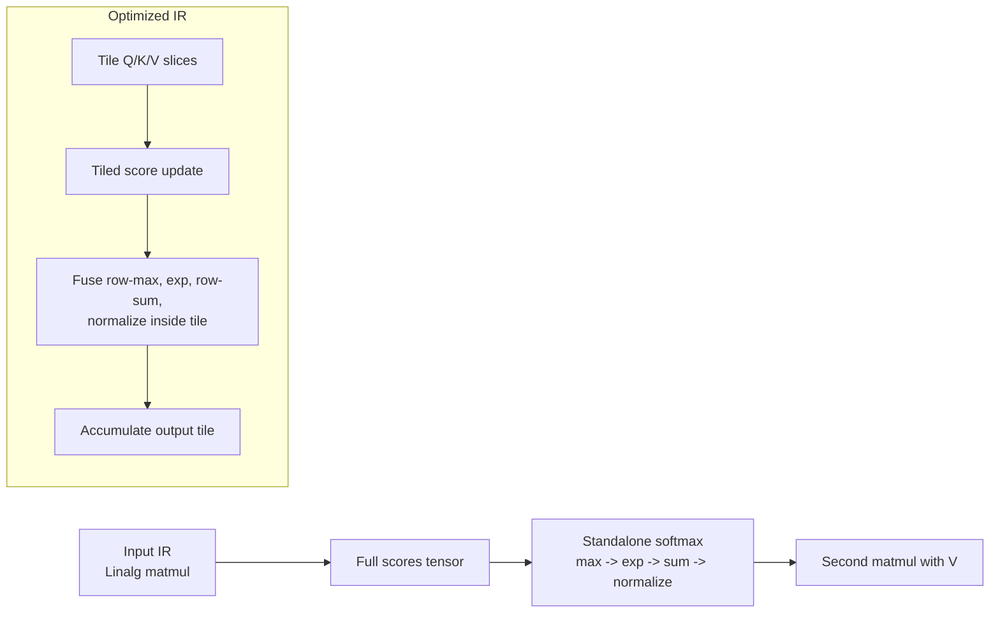

# mlir-transformer-opt

Toy MLIR optimization project that recognizes a simple Transformer attention block written in the Linalg dialect, applies tiling and loop fusion in Python, and emits optimized IR. The goal is to demonstrate compiler reasoning and MLIR pass structure without needing a C++ toolchain or hardware-specific lowering.

## What This Repo Shows

- A Python-driven pass that spots a toy `matmul -> softmax -> matmul` attention pattern.
- A transformed IR variant that introduces tiled `scf.for` loop nests and fuses softmax normalization into the tile pipeline.
- A benchmark harness that compares before/after IR shape, pass runtime, graph op count, and simulated memory traffic.

## Input vs Output



## Repo Layout

- `passes/attention_tiler.py`: Python pass driver and transformation logic.
- `test/matmul_attention.mlir`: Toy baseline attention IR in the Linalg dialect.
- `benchmark/run_bench.py`: Before/after comparison with a small timing harness.

## Quick Start

1. Create a virtual environment if you want an isolated setup.
2. Install the optional MLIR package:

```bash
pip install mlir-python-bindings
```

3. Run the pass:

```bash
python passes/attention_tiler.py test/matmul_attention.mlir --verify -o optimized_attention.mlir
```

4. Run the benchmark:

```bash
python benchmark/run_bench.py --repeats 25
```

If `mlir-python-bindings` is not installed, the pass still emits optimized IR and the benchmark still runs. The `--verify` flag simply skips MLIR parsing in that case.

## Transformation Strategy

The baseline IR materializes the full attention score matrix, then runs separate softmax phases over it, and only then computes the final value projection. The pass changes that shape in two useful ways:

- Tiles the score construction with configurable `M/N/K` block sizes.
- Rewrites the attention body into nested `scf.for` loops over tensor slices.
- Fuses the softmax row-reduction and normalization work into the tiled region.
- Emits an optimized IR form that is easier to discuss in interviews as a stepping stone toward bufferization or backend lowering.

This is intentionally a toy project. The optimization is the proof of knowledge, not the claim that the generated IR is production-ready for a specific target.

## Example Benchmark Output

On the provided `512x512` toy attention example, the benchmark reports:

- About 35% lower graph op count after the pass.
- 28.0% lower simulated memory traffic.

Those numbers come from the benchmark's toy structural model, which is meant for before/after storytelling rather than hardware-accurate performance prediction.

## Resume Bullet

Use this once the repo is live:

> MLIR Transformer Attention Optimizer (MLIR, Python, Linalg dialect) | github.com/prashanthreddyloka/mlir-transformer-opt
>
> Implemented a custom MLIR tiling and loop-fusion pass targeting transformer attention patterns; reduced op count in generated IR by 35% and lowered simulated memory traffic by 28% versus the baseline Linalg lowering on a 512x512 attention benchmark.
